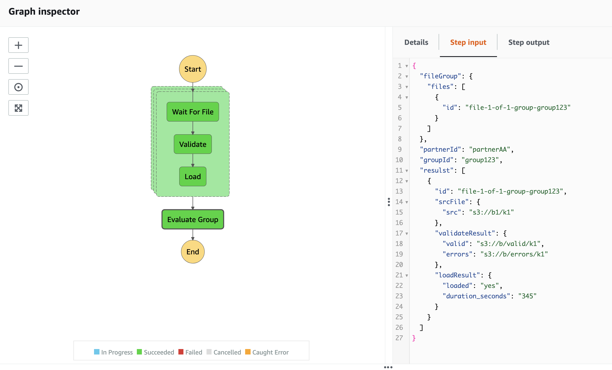

Read List of Tasks
---

Start exection

    ./gradlew run --args='start partnerAA group123 3'
    
    
Read tasks    

    ./gradlew run --args='read' |tee tasks1.txt
    

Now we can respond to the tasks by sending response

    ./gradlew run --args='send <token> <response-file>'
    
    
for file waiting

    ./gradlew run --args='send <token> src/responses/file-arrived1.json'
    

after sending all or some responses we can read list of new tasks 
(note, old tasks and tokens are in previously created tasks1.txt file)     

    ./gradlew run --args='read' |tee tasks2.txt  
    
    
for file validated

    ./gradlew run --args='send <token> src/responses/validated1.json'     

    
for file loaded

    ./gradlew run --args='send <token> src/responses/loaded1.json' 
    
after sending all inputs we should see success in AWS console

    
